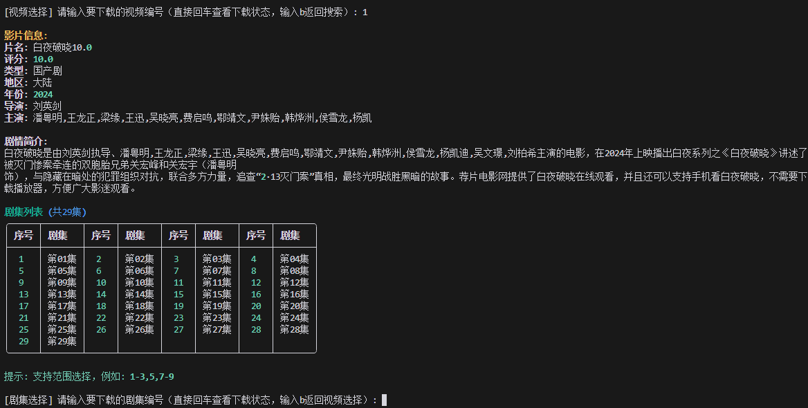
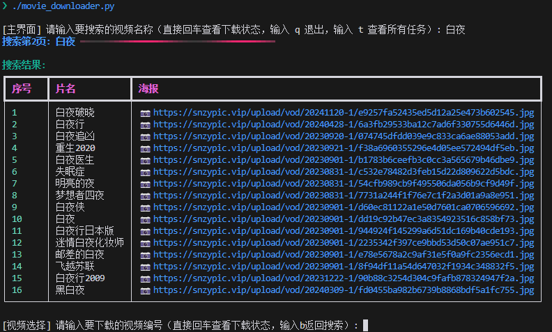
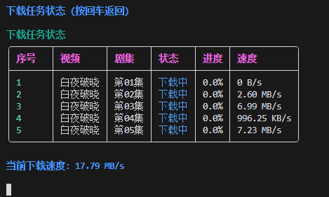
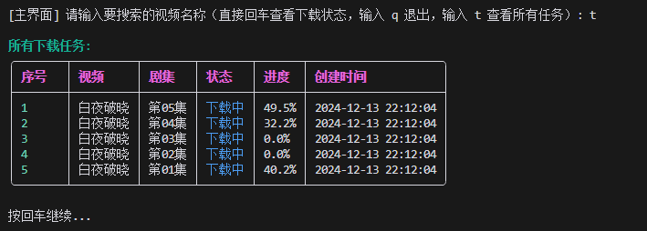

# 🎬 Movie Downloader Pro

<p align="center">
  <br>
  <em>一个优雅的视频下载工具</em>
</p>

<p align="center">
  <a href="#特性">特性</a> •
  <a href="#安装">安装</a> •
  <a href="#使用">使用</a> •
  <a href="#配置">配置</a> •
  <a href="#常见问题">常见问题</a>
</p>

<p align="center">
  
  
  
</p>

## ✨ 特性

- 🚀 **高速下载**: 支持多线程并发下载，充分利用带宽
- 🎯 **断点续传**: 支持任务中断后继续下载
- 📺 **批量下载**: 支持批量选择多个剧集
- 🎨 **优雅界面**: 精美的命令行交互界面
- 💾 **任务管理**: 完整的下载任务管理系统
- 🔄 **自动恢复**: 程序重启后自动恢复未完成的任务
- 📊 **实时进度**: 显示下载进度、速度等详细信息
- 🌈 **丰富提示**: 友好的操作提示和错误提醒

## 🔧 安装

1. 克隆仓库：
```bash
git clone https://github.com/skyfireitdiy/movie-downloader.git
cd movie-downloader
```

2. 安装依赖：
```bash
pip install -r requirements.txt
```

## 🚀 使用

运行程序：
```bash
python movie_downloader.py
```

### 基本操作

- 🔍 **搜索视频**: 输入关键词搜索视频
- 📋 **查看任务**: 直接回车查看当前下载状态
- 📜 **任务历史**: 输入 `t` 查看所有下载任务
- 🚪 **退出程序**: 输入 `q` 退出程序

### 下载操作

1. 输入视频关键词进行搜索
2. 从搜索结果中选择要下载的视频
3. 选择要下载的剧集（支持以下格式）：
   - 单集：`1`
   - 多集：`1,2,3`
   - 范围：`1-10`
   - 混合：`1-5,7,9-12`

### 剧集选择界面

<p align="center">
  
  <br>
  <em>剧集选择界面</em>
</p>

剧集界面会显示以下信息：

1. 📺 **影片信息**
   - 片名
   - 评分
   - 类型
   - 地区
   - 年份
   - 导演
   - 主演
   - 剧情简介

2. 📝 **剧集列表**
   - 以表格形式展示所有剧集
   - 支持多种选择方式：
     ```
     1     # 单集
     1,3,5 # 多集
     1-10  # 范围
     1-5,8 # 混合
     ```

3. ⌨️ **快捷操作**
   - 回车：查看下载状态
   - b：返回视频选择
   - q：退出程序

4. 🎯 **智能选集**
   - 自动跳过已下载的剧集
   - 支持中文逗号分隔
   - 范围选择时自动排序

## ⚙️ 配置

默认配置位于程序开头：
```python
default_path = "downloads"  # 默认下载目录
max_workers = 48           # 最大并行下载数
```

## 📝 任务管理

所有下载任务会自动保存在 `download_tasks.json` 文件中，包含：
- 视频信息
- 下载进度
- 任务状态
- 创建时间
- 保存路径

## 🎨 界面预览

<p align="center">
  
  <br>
  <em>搜索界面 - 支持模糊搜索和海报预览</em>
</p>

<p align="center">
  
  <br>
  <em>剧集界面 - 显示影片详情和剧集列表</em>
</p>

<p align="center">
  
  <br>
  <em>下载界面 - 实时显示下载进度和速度</em>
</p>

<p align="center">
  
  <br>
  <em>任务管理 - 查看所有下载任务的状态</em>
</p>

## ❓ 常见问题

**Q: 如何恢复中断的下载？**  
A: 程序会自动保存下载进度，重启后会自动恢复未完成的任务。

**Q: 下载的文件保存在哪里？**  
A: 默认保存在程序目录下的 `downloads` 文件夹中，每个视频会创建独立的文件夹。

**Q: 如何修改下载目录？**  
A: 可以修改程序开头的 `default_path` 变量来更改默认下载目录。

**Q: 下载速度很慢怎么办？**  
A: 可以尝试：
1. 调整 `max_workers` 参数（建议范围：32-64）
2. 检查网络连接是否稳定
3. 确认是否有其他程序占用带宽

**Q: 为什么有些视频无法下载？**  
A: 可能的原因：
1. 视频源不可用或已失效
2. 网络连接不稳定
3. 视频格式不支持

## 🛠 依赖项

- Python 3.7+
- requests
- beautifulsoup4
- m3u8
- rich
- tqdm

## 📄 许可证

本项目采用 MIT 许可证。详见 [LICENSE](LICENSE) 文件。

## 🙏 致谢

- [rich](https://github.com/Textualize/rich) - 终端美化
- [requests](https://github.com/psf/requests) - HTTP 请求
- [beautifulsoup4](https://www.crummy.com/software/BeautifulSoup/) - HTML 解析
- [m3u8](https://github.com/globocom/m3u8) - M3U8 解析
- [tqdm](https://github.com/tqdm/tqdm) - 进度条显示

## 📝 更新日志

### [1.0.0] - 2024-12-13

- ✨ 首次发布
- 🎯 支持多线程下载
- 📦 任务管理系统
- 🎨 美化界面
- 🔄 断点续传功能

---

<p align="center">
  Made with ❤️ by <a href="https://github.com/skyfireitdiy">skyfireitdiy</a>
</p>
